# Task Manager API

API para gerenciamento de tarefas utilizando Java e Spring Boot.

## 🛠 Tecnologias

- Java 21
- Spring Boot 3
- PostgreSQL
- Spring Data JPA
- Lombok
- Swagger

## 🚀 Como executar o projeto

### Pré-requisitos

- Java 21+
- Maven
- PostgreSQL

## Configuração do Banco de Dados

1. Crie um banco de dados no PostgreSQL chamado `task_manager`.
2. Configure as credenciais no arquivo `application.properties`:

```properties
spring.datasource.url=jdbc:postgresql://localhost:5432/task_manager
spring.datasource.username=seu_usuario
spring.datasource.password=sua_senha
spring.jpa.hibernate.ddl-auto=update

```

## Rodando o projeto

### Clone o repositório:

```bash
git clone https://github.com/italoccosta/task-manager.git
cd task-manager
```

### Compile e execute:

```bash
mvn spring-boot:run
```

#### Acesse a API em http://localhost:8080/api/tasks

## 📌 Endpoints

| Método     | Rota              | Descrição                  |
| ---------- | ----------------- | -------------------------- |
| **GET**    | `/api/tasks`      | Lista todas as tarefas     |
| **GET**    | `/api/tasks/{id}` | Retorna uma tarefa pelo ID |
| **POST**   | `/api/tasks`      | Cria uma nova tarefa       |
| **PUT**    | `/api/tasks/{id}` | Atualiza uma tarefa        |
| **DELETE** | `/api/tasks/{id}` | Remove uma tarefa          |

## 📌 Estrutura das Classes

| Classe              | Atributos                                                                                                                                      |
| ------------------- | ---------------------------------------------------------------------------------------------------------------------------------------------- |
| **Task**            | `Long id` <br> `String title` <br> `String description` <br> `TaskStatus status` <br> `LocalDateTime createdAt` <br> `LocalDateTime updatedAt` |
| **TaskStatus**      | `PENDING` <br> `IN_PROGRESS` <br> `COMPLETED`                                                                                                  |
| **TaskRequestDTO**  | `String title` <br> `String description` <br> `TaskStatus status`                                                                              |
| **TaskResponseDTO** | `Long id` <br> `String title` <br> `String description` <br> `TaskStatus status` <br> `LocalDateTime createdAt`                                |

## 📌 Diagrama de Classes

```mermaid
classDiagram
    class Task {
        - Long id
        - String title
        - String description
        - TaskStatus status
        - LocalDateTime createdAt
        - LocalDateTime updatedAt
        + getters
        + setters
    }

    class TaskStatus {
        + PENDING
        + IN_PROGRESS
        + COMPLETED
    }

    class TaskRequestDTO {
        + String title
        + String description
        + TaskStatus status
    }

    class TaskResponseDTO {
        + Long id
        + String title
        + String description
        + TaskStatus status
        + LocalDateTime createdAt
    }

    Task --> TaskStatus : status
    TaskRequestDTO --> Task : "Criação e atualização"
    TaskResponseDTO --> Task : "Retorno da API"



```



## 📝 Autor

### Italo C. Costa - [GitHub](https://github.com/italoccosta)
